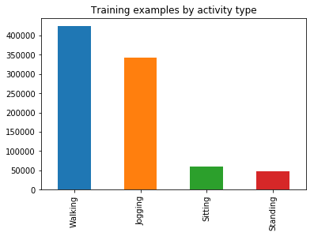

# Human Activity Recognition by Transfer Learning

Recognizing human activities using transfer learnig concept. Here transfer learning concept is used from one dataset to another different dataset. Between the 2 datasets 4 activities are common. So transfer learing is used for this common activities between the 2 datasets.

### Common Activities
- Jogging
- Sitting
- Walking
- Standaing

# Dataset

  - **HASC**
  - **WISDM**

# Tools

- **Jupyter Notebook**
- **PyTorch**

# Description
- **Activities** for the WISDM dataset

- Test Accuracy : **56.3950%**
